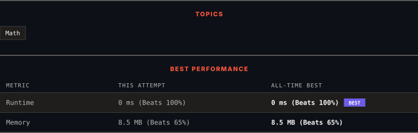

<div align="center">

# 9. Palindrome Number

      

[](https://leetcode.com/problems/palindrome-number/)

</div>

---

<div align="center">

<picture>
  <source media="(prefers-color-scheme: dark)" srcset="panel-dark.svg">
  <source media="(prefers-color-scheme: light)" srcset="panel-light.svg">
  
</picture>

</div>

> **New personal best** — Runtime improved on this submission.

### HOW IT WENT

| | |
|:--|:--|
| **Attempts** | 2 before accepted |
| **Time to solve** | 2 min |
| **Verdicts** | 💥 Runtime Error → ✅ Accepted |

---

### NOTES

_No notes yet._

---

### SOLUTIONS (1)

| # | File | Language | Date |
|:-:|------|:--------:|:----:|
| 1 | [sol1.cpp](./sol1.cpp) | `C++` | 2026-09-28 ← **latest** |

---

### PROBLEM DESCRIPTION

Given an integer `x`, return `true` if `x` is a **palindrome**, and `false` otherwise.

 

**Example 1:**

```

**Input:** x = 121
**Output:** true
**Explanation:** 121 reads as 121 from left to right and from right to left.

```

**Example 2:**

```

**Input:** x = -121
**Output:** false
**Explanation:** From left to right, it reads -121. From right to left, it becomes 121-. Therefore it is not a palindrome.

```

**Example 3:**

```

**Input:** x = 10
**Output:** false
**Explanation:** Reads 01 from right to left. Therefore it is not a palindrome.

```

 

**Constraints:**

	- `-2^31 <= x <= 2^31 - 1`

 

**Follow up:** Could you solve it without converting the integer to a string?

---

<div align="center">

<sub>Auto-synced by <strong>LeetSync</strong> · Built by <a href="https://deveshsamant.in/">Devesh Samant</a></sub>

</div>
