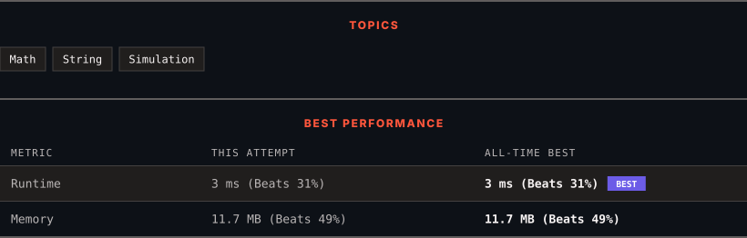

<div align="center">

# 412. Fizz Buzz

      

[](https://leetcode.com/problems/fizz-buzz/)

</div>

---

<div align="center">

<picture>
  <source media="(prefers-color-scheme: dark)" srcset="panel-dark.svg">
  <source media="(prefers-color-scheme: light)" srcset="panel-light.svg">
  
</picture>

</div>

> **New personal best** — Runtime improved on this submission.

### HOW IT WENT

| | |
|:--|:--|
| **Attempts** | first try |
| **Time to solve** | under a minute |
| **Verdicts** | ✅ Accepted |

---

### NOTES

_No notes yet._

---

### SOLUTIONS (1)

| # | File | Language | Date |
|:-:|------|:--------:|:----:|
| 1 | [sol1.cpp](./sol1.cpp) | `C++` | 2026-09-28 ← **latest** |

---

### PROBLEM DESCRIPTION

Given an integer `n`, return *a string array *`answer`* (**1-indexed**) where*:

	- `answer[i] == "FizzBuzz"` if `i` is divisible by `3` and `5`.

	- `answer[i] == "Fizz"` if `i` is divisible by `3`.

	- `answer[i] == "Buzz"` if `i` is divisible by `5`.

	- `answer[i] == i` (as a string) if none of the above conditions are true.

 

**Example 1:**

```
**Input:** n = 3
**Output:** ["1","2","Fizz"]

```

**Example 2:**

```
**Input:** n = 5
**Output:** ["1","2","Fizz","4","Buzz"]

```

**Example 3:**

```
**Input:** n = 15
**Output:** ["1","2","Fizz","4","Buzz","Fizz","7","8","Fizz","Buzz","11","Fizz","13","14","FizzBuzz"]

```

 

**Constraints:**

	- `1 <= n <= 10^4`

---

<div align="center">

<sub>Auto-synced by <strong>LeetSync</strong> · Built by <a href="https://deveshsamant.in/">Devesh Samant</a></sub>

</div>
