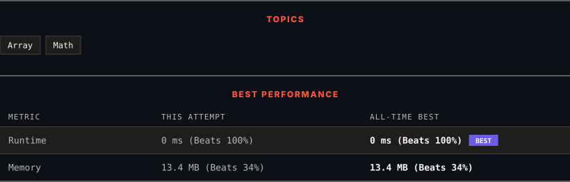

<div align="center">

# 1295. Find Numbers with Even Number of Digits

      

[](https://leetcode.com/problems/find-numbers-with-even-number-of-digits/)

</div>

---

<div align="center">

<picture>
  <source media="(prefers-color-scheme: dark)" srcset="panel-dark.svg">
  <source media="(prefers-color-scheme: light)" srcset="panel-light.svg">
  
</picture>

</div>

> **New personal best** — Runtime improved on this submission.

### HOW IT WENT

| | |
|:--|:--|
| **Attempts** | first try |
| **Time to solve** | under a minute |
| **Verdicts** | ✅ Accepted |

---

### NOTES

_No notes yet._

---

### SOLUTIONS (1)

| # | File | Language | Date |
|:-:|------|:--------:|:----:|
| 1 | [sol1.cpp](./sol1.cpp) | `C++` | 2026-09-29 ← **latest** |

---

### PROBLEM DESCRIPTION

Given an array `nums` of integers, return how many of them contain an **even number** of digits.

 

**Example 1:**

```

**Input:** nums = [12,345,2,6,7896]
**Output:** 2
**Explanation: 
**12 contains 2 digits (even number of digits). 
345 contains 3 digits (odd number of digits). 
2 contains 1 digit (odd number of digits). 
6 contains 1 digit (odd number of digits). 
7896 contains 4 digits (even number of digits). 
Therefore only 12 and 7896 contain an even number of digits.

```

**Example 2:**

```

**Input:** nums = [555,901,482,1771]
**Output:** 1 
**Explanation: **
Only 1771 contains an even number of digits.

```

 

**Constraints:**

	- `1 <= nums.length <= 500`

	- `1 <= nums[i] <= 10^5`

---

<div align="center">

<sub>Auto-synced by <strong>LeetSync</strong> · Built by <a href="https://deveshsamant.in/">Devesh Samant</a></sub>

</div>
