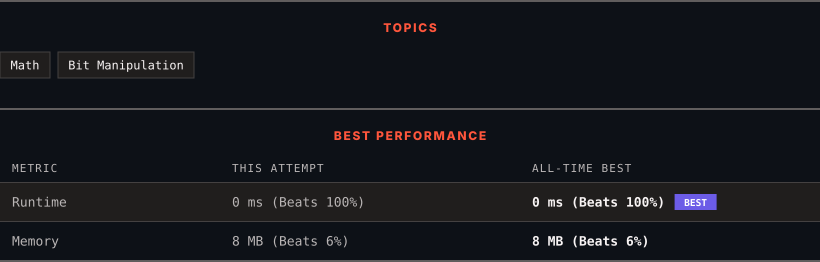

<div align="center">

# 1342. Number of Steps to Reduce a Number to Zero

      

[](https://leetcode.com/problems/number-of-steps-to-reduce-a-number-to-zero/)

</div>

---

<div align="center">

<picture>
  <source media="(prefers-color-scheme: dark)" srcset="panel-dark.svg">
  <source media="(prefers-color-scheme: light)" srcset="panel-light.svg">
  
</picture>

</div>

> **New personal best** — Runtime improved on this submission.

### HOW IT WENT

| | |
|:--|:--|
| **Attempts** | first try |
| **Time to solve** | 2 min |
| **Verdicts** | ✅ Accepted |

---

### NOTES

_No notes yet._

---

### SOLUTIONS (1)

| # | File | Language | Date |
|:-:|------|:--------:|:----:|
| 1 | [sol1.cpp](./sol1.cpp) | `C++` | 2026-09-28 ← **latest** |

---

### PROBLEM DESCRIPTION

Given an integer `num`, return *the number of steps to reduce it to zero*.

In one step, if the current number is even, you have to divide it by `2`, otherwise, you have to subtract `1` from it.

 

**Example 1:**

```

**Input:** num = 14
**Output:** 6
**Explanation:** 
Step 1) 14 is even; divide by 2 and obtain 7. 
Step 2) 7 is odd; subtract 1 and obtain 6.
Step 3) 6 is even; divide by 2 and obtain 3. 
Step 4) 3 is odd; subtract 1 and obtain 2. 
Step 5) 2 is even; divide by 2 and obtain 1. 
Step 6) 1 is odd; subtract 1 and obtain 0.

```

**Example 2:**

```

**Input:** num = 8
**Output:** 4
**Explanation:** 
Step 1) 8 is even; divide by 2 and obtain 4. 
Step 2) 4 is even; divide by 2 and obtain 2. 
Step 3) 2 is even; divide by 2 and obtain 1. 
Step 4) 1 is odd; subtract 1 and obtain 0.

```

**Example 3:**

```

**Input:** num = 123
**Output:** 12

```

 

**Constraints:**

	- `0 <= num <= 10^6`

---

<div align="center">

<sub>Auto-synced by <strong>LeetSync</strong> · Built by <a href="https://deveshsamant.in/">Devesh Samant</a></sub>

</div>
