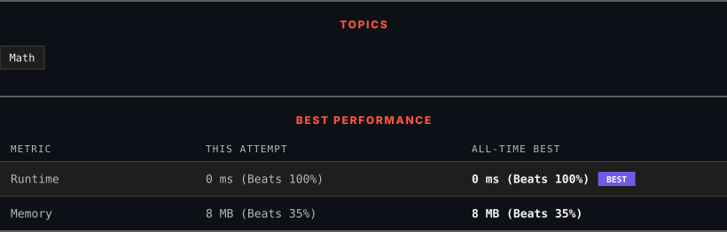

<div align="center">

# 2235. Add Two Integers

      

[](https://leetcode.com/problems/add-two-integers/)

</div>

---

<div align="center">

<picture>
  <source media="(prefers-color-scheme: dark)" srcset="panel-dark.svg">
  <source media="(prefers-color-scheme: light)" srcset="panel-light.svg">
  
</picture>

</div>

> **New personal best** — Runtime improved on this submission.

### HOW IT WENT

| | |
|:--|:--|
| **Attempts** | first try |
| **Time to solve** | under a minute |
| **Verdicts** | ✅ Accepted |

---

### NOTES

_No notes yet._

---

### SOLUTIONS (1)

| # | File | Language | Date |
|:-:|------|:--------:|:----:|
| 1 | [sol1.cpp](./sol1.cpp) | `C++` | 2026-09-28 ← **latest** |

---

### PROBLEM DESCRIPTION

Given two integers `num1` and `num2`, return *the **sum** of the two integers*.
 

**Example 1:**

```

**Input:** num1 = 12, num2 = 5
**Output:** 17
**Explanation:** num1 is 12, num2 is 5, and their sum is 12 + 5 = 17, so 17 is returned.

```

**Example 2:**

```

**Input:** num1 = -10, num2 = 4
**Output:** -6
**Explanation:** num1 + num2 = -6, so -6 is returned.

```

 

**Constraints:**

	- `-100 <= num1, num2 <= 100`

---

<div align="center">

<sub>Auto-synced by <strong>LeetSync</strong> · Built by <a href="https://deveshsamant.in/">Devesh Samant</a></sub>

</div>
